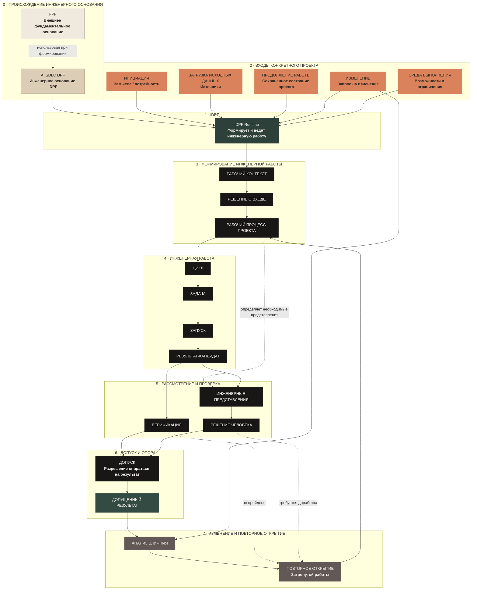

Диаграмма

```mermaid
flowchart TB

%% ─────────────────────────────────────────
%% 0. ПРОИСХОЖДЕНИЕ ИНЖЕНЕРНОГО ОСНОВАНИЯ
%% ─────────────────────────────────────────

subgraph F0["0 · ПРОИСХОЖДЕНИЕ ИНЖЕНЕРНОГО ОСНОВАНИЯ"]
direction LR
    FPF["FPF<br/><b>Внешнее фундаментальное основание</b>"]
    DPF["AI SDLC DPF<br/><b>Инженерное основание iDPF</b>"]
end

FPF -->|"использован при формировании"| DPF


%% ─────────────────────────────────────────
%% 1. iDPF
%% ─────────────────────────────────────────

subgraph F1["1 · iDPF"]
direction TB
    RUNTIME["iDPF Runtime<br/><b>Формирует и ведёт инженерную работу</b>"]
end

DPF --> RUNTIME


%% ─────────────────────────────────────────
%% 2. ВХОДЫ КОНКРЕТНОГО ПРОЕКТА
%% ─────────────────────────────────────────

subgraph F2["2 · ВХОДЫ КОНКРЕТНОГО ПРОЕКТА"]
direction LR
    I["ИНИЦИАЦИЯ<br/><b>Замысел / потребность</b>"]
    S["ЗАГРУЗКА ИСХОДНЫХ ДАННЫХ<br/><b>Источники</b>"]
    E["ПРОДОЛЖЕНИЕ РАБОТЫ<br/><b>Сохранённое состояние проекта</b>"]
    C["ИЗМЕНЕНИЕ<br/><b>Запрос на изменение</b>"]
    H["СРЕДА ВЫПОЛНЕНИЯ<br/><b>Возможности и ограничения</b>"]
end


%% ─────────────────────────────────────────
%% 3. ФОРМИРОВАНИЕ ИНЖЕНЕРНОЙ РАБОТЫ
%% ─────────────────────────────────────────

subgraph F3["3 · ФОРМИРОВАНИЕ ИНЖЕНЕРНОЙ РАБОТЫ"]
direction LR
    WC["РАБОЧИЙ КОНТЕКСТ"]
    ED["РЕШЕНИЕ О ВХОДЕ"]
    WP["РАБОЧИЙ ПРОЦЕСС ПРОЕКТА"]
end


%% ─────────────────────────────────────────
%% 4. ВЫПОЛНЕНИЕ
%% ─────────────────────────────────────────

subgraph F4["4 · ИНЖЕНЕРНАЯ РАБОТА"]
direction LR
    LOOP["ЦИКЛ"]
    TASK["ЗАДАЧА"]
    RUN["ЗАПУСК"]
    CR["РЕЗУЛЬТАТ-КАНДИДАТ"]
end


%% ─────────────────────────────────────────
%% 5. РАССМОТРЕНИЕ И ПРОВЕРКА
%% ─────────────────────────────────────────

subgraph F5["5 · РАССМОТРЕНИЕ И ПРОВЕРКА"]
direction LR
    VIEW["ИНЖЕНЕРНЫЕ ПРЕДСТАВЛЕНИЯ"]
    GATE["РЕШЕНИЕ ЧЕЛОВЕКА"]
    VER["ВЕРИФИКАЦИЯ"]
end


%% ─────────────────────────────────────────
%% 6. ДОПУСК И ОПОРА
%% ─────────────────────────────────────────

subgraph F6["6 · ДОПУСК И ОПОРА"]
direction LR
    ADM["ДОПУСК<br/><b>Разрешение опираться на результат</b>"]
    RR["ДОПУЩЕННЫЙ РЕЗУЛЬТАТ"]
end


%% ─────────────────────────────────────────
%% 7. ИЗМЕНЕНИЕ
%% ─────────────────────────────────────────

subgraph F7["7 · ИЗМЕНЕНИЕ И ПОВТОРНОЕ ОТКРЫТИЕ"]
direction LR
    IMP["АНАЛИЗ ВЛИЯНИЯ"]
    REOPEN["ПОВТОРНОЕ ОТКРЫТИЕ<br/><b>Затронутой работы</b>"]
end


%% ВХОДЫ В RUNTIME
I --> RUNTIME
S --> RUNTIME
E --> RUNTIME
C --> RUNTIME
H --> RUNTIME

%% ФОРМИРОВАНИЕ РАБОТЫ
RUNTIME --> WC
WC --> ED
ED --> WP

%% ВЫПОЛНЕНИЕ
WP --> LOOP
LOOP --> TASK
TASK --> RUN
RUN --> CR

%% РАССМОТРЕНИЕ И ПРОВЕРКА
WP -. "определяет необходимые представления" .-> VIEW
CR --> VIEW
CR --> VER
VIEW --> GATE

%% ДОПУСК
VER --> ADM
GATE --> ADM
ADM --> RR

%% ИЗМЕНЕНИЯ
RR --> IMP
C --> IMP
IMP --> REOPEN
REOPEN --> WP

%% ВОЗВРАТ ПРИ НЕУСПЕХЕ
VER -. "не пройдено" .-> REOPEN
GATE -. "требуется доработка" .-> REOPEN


%% ─────────────────────────────────────────
%% СТИЛИ
%% ─────────────────────────────────────────

classDef external fill:#EFE9DE,color:#27231F,stroke:#8F8577,stroke-width:1px;
classDef foundation fill:#DCCDB7,color:#27231F,stroke:#8F795D,stroke-width:1px;
classDef runtime fill:#2E403A,color:#F7F4EE,stroke:#2E403A,stroke-width:2px;
classDef input fill:#D9825B,color:#27231F,stroke:#D9825B,stroke-width:1px;
classDef core fill:#181715,color:#F7F4EE,stroke:#181715,stroke-width:1px;
classDef relied fill:#344B43,color:#F7F4EE,stroke:#344B43,stroke-width:1px;
classDef change fill:#625956,color:#F7F4EE,stroke:#625956,stroke-width:1px;

class FPF external;
class DPF foundation;
class RUNTIME runtime;
class I,S,E,C,H input;
class WC,ED,WP,LOOP,TASK,RUN,CR,VIEW,GATE,VER,ADM core;
class RR relied;
class IMP,REOPEN change;
```
